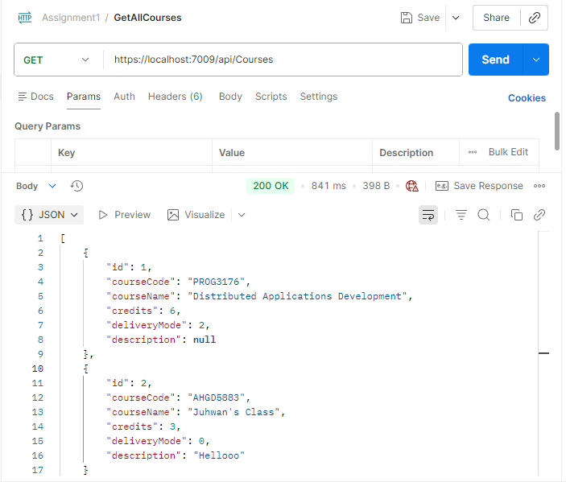
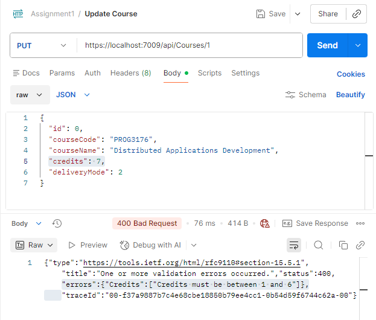
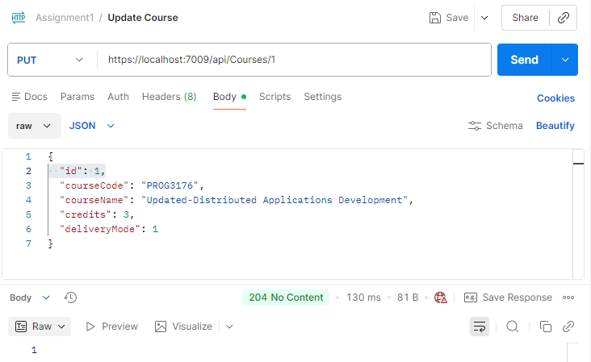
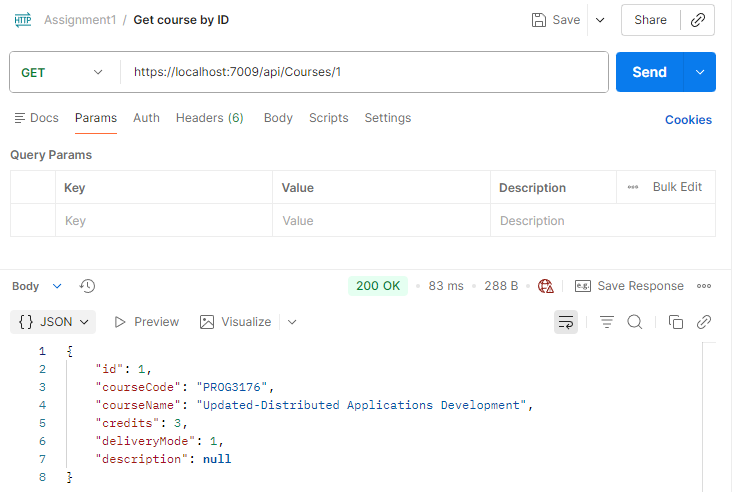
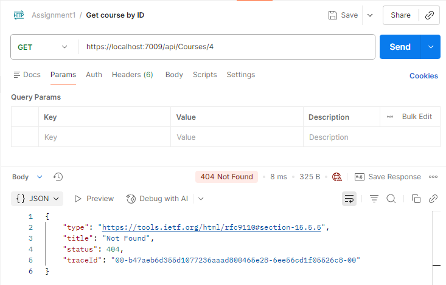
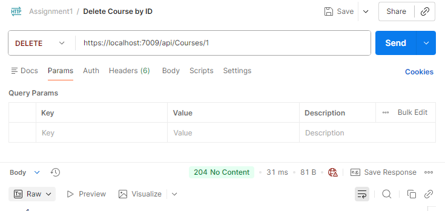
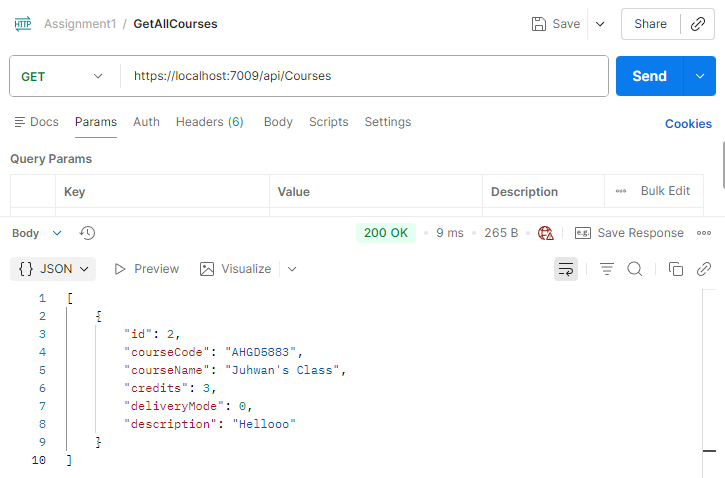

# Assignment 1: Course Microservice with CRUD API

Course: PROG3176 - Winter 2026 - Section 1  
Programmed by: Juhwan Seo [8819123]
Due Date: Feb 6, 2026

---

## Description

This microservice provides a RESTful API for managing college courses. It supports full CRUD (Create, Read, Update, Delete) operations using ASP.NET Core Web API, Entity Framework Core, and SQLite. API documentation and testing are available via Swagger UI.

---

## Domain Model

**Entity:** Course

| Property      | Type    | Required | Description                                                    |
|---------------|---------|----------|----------------------------------------------------------------|
| Id            | int     | Yes      | Primary key                                                    |
| CourseCode    | string  | Yes      | 3-4 uppercase letters + 4 digits (e.g., PROG3176), validated   |
| CourseName    | string  | Yes      | Course name (max 100 chars)                                    |
| Credits       | int     | Yes      | Number of credits (1-6)                                        |
| DeliveryMode  | enum    | Yes      | Online, InPerson, Hybrid                                       |
| Description   | string? | No       | Optional course description (max 500 chars)                    |

**Validation:**
- CourseCode: `[Required]`, `[RegularExpression]`
- CourseName: `[Required]`, `[StringLength(100)]`
- Credits: `[Required]`, `[Range(1, 6)]`
- DeliveryMode: `[Required]`
- Description: `[StringLength(500)]`

---

## How to Run

### Prerequisites
- .NET 10.0 SDK
- (Optional) Visual Studio 2022 or VS Code

### Steps

1. Clone or extract the project.
2. Navigate to the project directory:
   ```
   cd JuhwanSeo_Assignment1
   ```
3. Apply database migrations:
   ```
   dotnet ef database update
   ```
4. Run the project:
   ```
   dotnet run
   ```
5. Open Swagger UI in your browser:
   ```
   https://localhost:7009/swagger
   ```

---

## API Endpoints

| Method | Endpoint           | Description              |
|--------|--------------------|--------------------------|
| GET    | /api/Courses       | Get all courses          |
| GET    | /api/Courses/{id}  | Get course by ID         |
| POST   | /api/Courses       | Create new course        |
| PUT    | /api/Courses/{id}  | Update course            |
| DELETE | /api/Courses/{id}  | Delete course            |

---

## Screenshots

Below are screenshots demonstrating successful and error CRUD operations in Postman:

- **Create Course (POST)**  
  
<sub>File: doc_res/01_postman_PostCourse.png</sub>

- **Read All Courses (GET all)**  
  
<sub>File: doc_res/02_postman_GetAllCourses.png</sub>

- **Update Course (PUT, error 400 - validation)**  
  
<sub>File: doc_res/03_postman_PutCourse_ERROR_400.png</sub>

- **Update Course (PUT, success)**  
  
<sub>File: doc_res/04_postman_PutCourse.png</sub>

- **Read Course by ID (GET by id, success)**  
  
<sub>File: doc_res/05_postman_GetCourseById.png</sub>

- **Read Course by ID (GET by id, error 404)**  
  
<sub>File: doc_res/06_postman_GetCourseById_Error_404.png</sub>

- **Delete Course by ID (DELETE, success)**  
  
<sub>File: doc_res/07_postman_DeleteCourseById.png</sub>

- **Read All Courses After Delete (GET all)**  
  
<sub>File: doc_res/08_postman_GetAllCourses_after_delete_course.png</sub>
